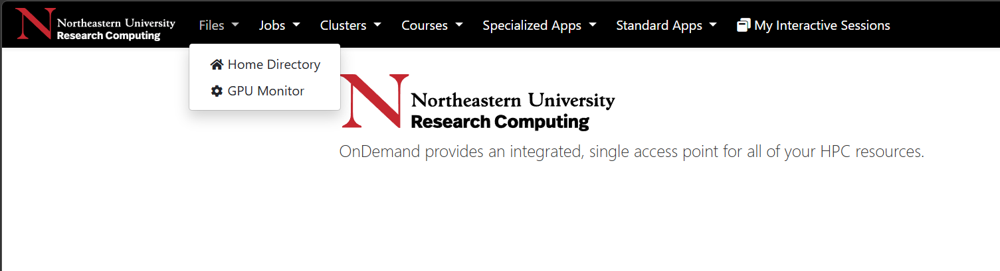
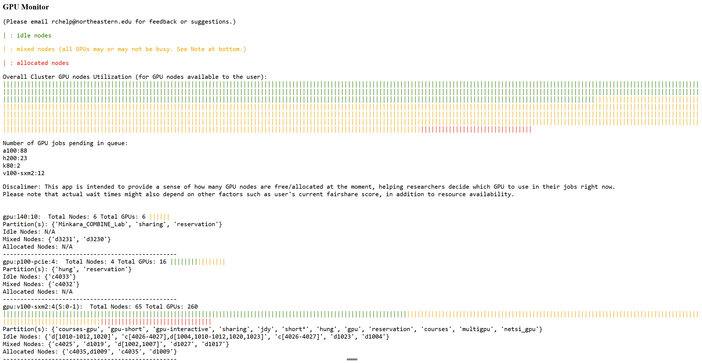
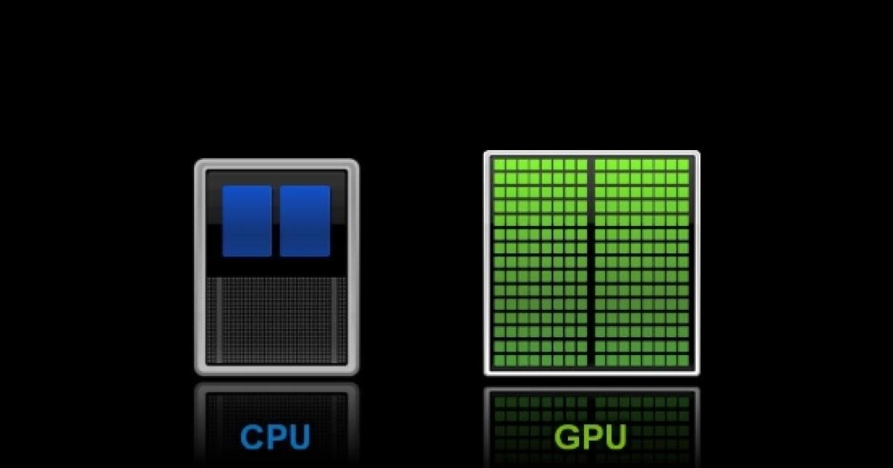
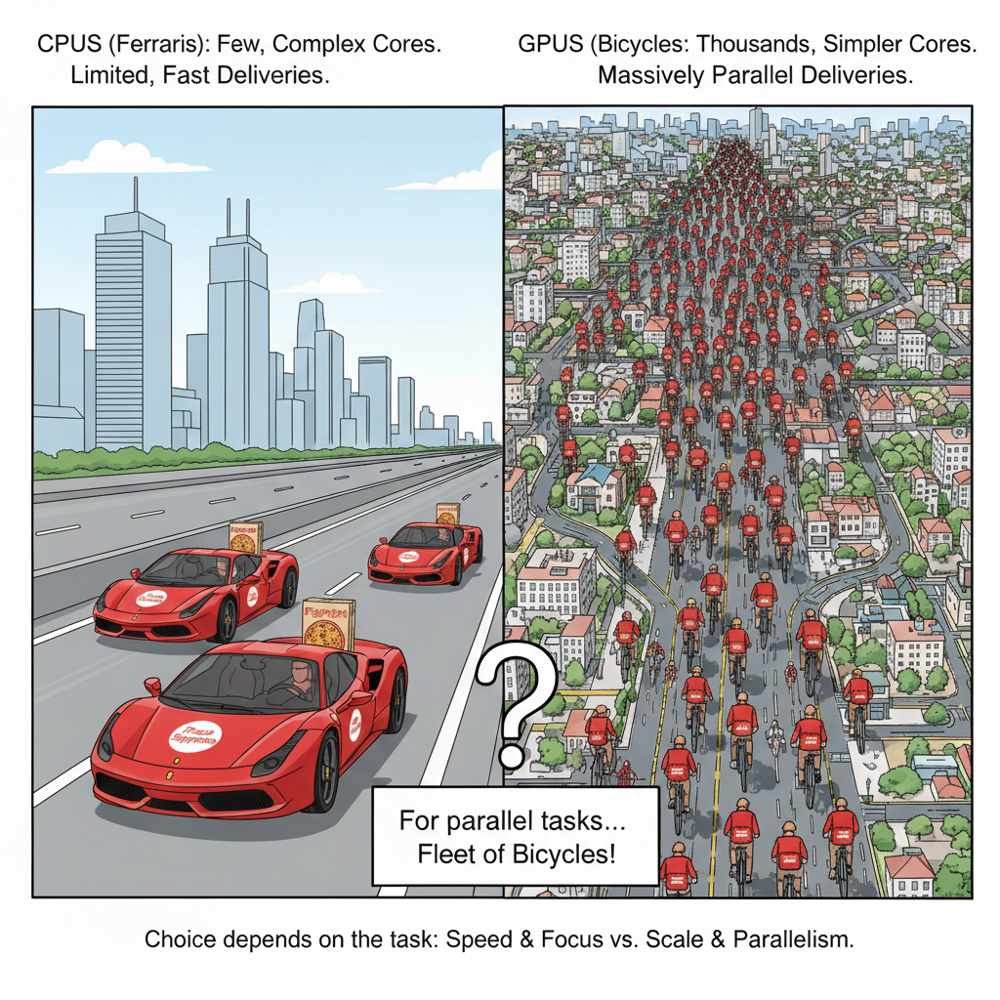
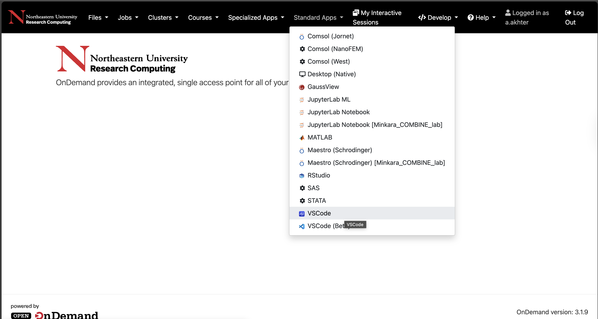
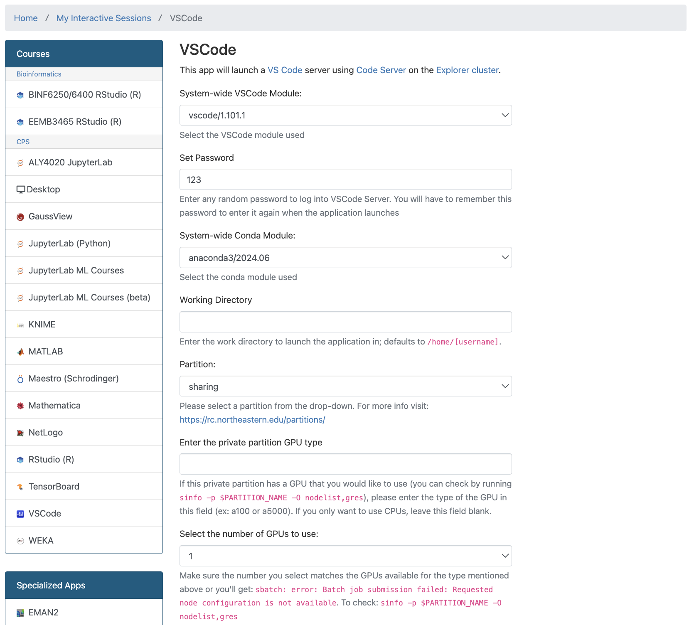
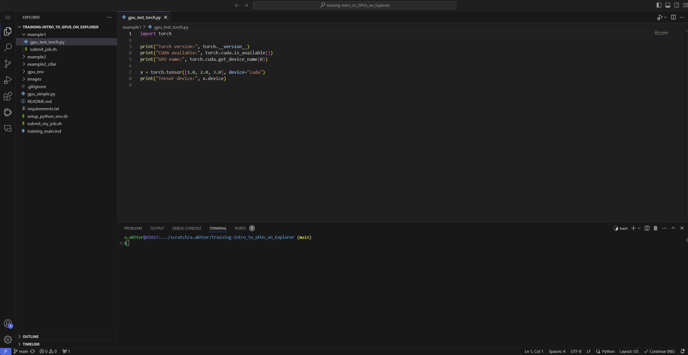

<br>
<br>

# Research Computing Training

## Presenter

Arsalan Akhter

Research Computing Specialist

[Research Computing](https://rc.northeastern.edu/research-computing-team/)

## Introduction to GPUs on Explorer


Welcome to another session in the [Research Computing Spring 2026 Training Series](https://rc.northeastern.edu/research-computing-spring-training/)! This guide will help you get started with GPU computing on the Explorer cluster.

This is a beginner-friendly introduction to using the GPUs on the Explorer cluster.

By attending this presentation you will get an introduction to:

1. [Accessing Explorer](#accessing-explorer)
2. [Which GPU Partitions are available on Explorer?](#which-gpu-partitions-are-available-on-explorer)
3. [Which GPU Types are available on Explorer?](#which-gpu-types-are-available-on-explorer)
4. [What are GPUs, anyway?](#what-are-gpus-anyway)
5. [Ok, I know about GPUs on Explorer. How do I use them?](#ok-i-know-about-gpus-on-explorer-how-do-i-use-them)
6. [Prerequisite](#prerequisite)
7. [Open OnDemand (OOD)](#open-ondemand-ood)
8. [Interactive GPU Sessions](#interactive-gpu-sessions)
9. [Batch Jobs with SLURM](#batch-jobs-with-slurm)
10. [Monitoring Your Jobs](#monitoring-your-jobs)
11. [Using GPUs Efficiently](#using-gpus-efficiently)
12. [Best Practices for Using GPUs on Explorer](#best-practices-for-using-gpus-on-explorer)
13. [How to get help](#how-to-get-help)

All these materials are also available at [Intro To GPUs Github Repo](https://github.com/northeastern-rc-training/Intro-to-GPUs-2026/blob/main/training_main.md).

You are welcome to follow along by typing the commands in your terminal. You can also just watch the demo, and try it later at your own pace. The recordings for this session will also be made available later on the [Research Computing website](https://rc.northeastern.edu/research-computing-spring-training/). 

Let's get started!

## Accessing Explorer
To access the Explorer cluster, use SSH to connect from your local machine:
```bash
ssh username@login.explorer.northeastern.edu
```
Replace `username` with your actual username.

## Which GPU Partitions are available on Explorer?

Here are 5 (plus one) of the commonly used GPU partitions on Explorer:
- `gpu`: General-purpose GPU partition. (max: 8 hours)
- `gpu-interactive`: GPU sessions for Open OnDemand based development/testing. (max: 2 hours)
- `gpu-short`: Short-duration GPU jobs. Jobs in this partition are prioritized. Use this partition for quick tests or short tasks. (max: 2 hours)
- `multigpu`: For jobs that require multiple GPUs. [See details here](https://rc-docs.northeastern.edu/en/latest/gpus/multigpu-partition-access.html) (max: 24 hours)
- `courses-gpu`: Dedicated to courses-related GPU jobs. Instructors are welcome to request access for their courses. (max: 24 hours)
- Bonus: `sharing`: GPUs shared by Northeastern PIs for general community use. (max: 1 hour)

## Which GPU Types are available on Explorer?

For any given partition, we can type the following command in the Explorer terminal to see the available GPU types on that partition:

```bash
sinfo -p <partition_name> -o "%G"
```
For example, for the `gpu` partition, we have:

```bash
sinfo -p gpu -o "%G"
GRES
gpu:v100-sxm2:4(S:0-1)
gpu:t4:4(S:0-1)
gpu:a100:3
gpu:a100:4
gpu:h200:8
gpu:v100-pcie:2(S:0-1)
gpu:v100-sxm2:3(S:0-1)
```

> 💡 **Question for Audience:** Which GPUs are available in the `sharing` partition? 

Hint: (Try `sinfo -p sharing -o "%G"`)

> 💡 **Question for Audience:** Would it be useful to know which GPUs are available on a partition before submitting a job? 

**Hint:** Try the following command:
```bash
sinfo -p gpu -O "NodeList,Gres:30,GresUsed:30"
```

We also have a GPU-monitor app available on Open OnDemand (OOD) that shows which GPU nodes are available/Idle.





Once a certain GPU type node seems free to you, use the following command in terminal to see if the node is indeed available.

```bash
 sinfo -n nodename --Format="Gres:30,GresUsed:30" 
```

Please note that "MIXED" state does not mean that all GPUs are available. "MIXED" refers to the state of all the "CPUs" on the node, and not the GPUs. So that is why we need to check if the GPUs are available using the above command.


## What are GPUs, anyway?

Before we look at that question, can someone share what a core is?
> **Answer:** A core is a processing unit that can independently execute instructions. 

In simple terms:

- CPUs have a few, complex cores.
- GPUs, have thousands of smaller, simpler cores.



(Source: https://blogs.nvidia.com/blog/whats-the-difference-between-a-cpu-and-a-gpu/)


So it depends what do we want to achieve. For tasks that can be massively parallelized, GPUs are the perfect choice.

Consider the analogy of delivering thousands of pizzas across a city. We have a few Ferraris and thousands of bicycles:

- **CPUs (Ferraris):** A few high-speed vehicles that can deliver pizzas quickly to a limited number of locations.
 - **GPUs (Bicycles):** A large fleet of bicycles that can deliver pizzas to many locations in parallel.

Which one would we choose? Fleet of bicycles, of course.



Here is another analogy. Consider a group of professors in a room with large whiteboards, vs. a stadium full of students with handheld calculators and sticky notes. Every student has the data that they need, and they are listening to a megaphone. 

Professors can do complex mathematical operations and problems much faster. 

But if we need to just multiply a very large matrix, meaning computing multiply and add operations for each slot in the resulting matrix, the stadium full of students makes more sense!

The point is, we use GPUs for tasks that can be massively parallelized, such as:
- Machine Learning and Deep Learning
- Scientific Simulations
- Data Analysis and Visualization

## Ok, I know about GPUs on Explorer. How do I use them?

There are three main ways to use GPUs on Explorer:
1. **Open OnDemand (OOD):** A web-based interface that allows you to run GPU jobs interactively.

2. **Interactive Sessions:** You can request an interactive GPU session using `srun`

3. **Batch Jobs:** You can submit batch jobs to the GPU partitions using SLURM job scripts.

## Prerequisite

Let's clone the directory that we'll be using for this demo

1. In a terminal, let's login to `username@login.explorer.northeastern.edu`
2. After logging in, let's type `cd /scratch/$USER`. This takes us to our own scratch directory.
3. Run the command `git clone git@github.com:northeastern-rc-training/Intro-to-GPUs-2026.git`

## Open OnDemand (OOD):

We will run `gpu_simple.py` in Open OnDemand (OOD), by following these steps.

1. Let's go to ood.explorer.northeastern.edu. Login.
2. Under `Standard Apps`, let's select VSCode Server



3. Enter a (simple) password, (e.g. `123`), select `sharing` as partition, and select `1` GPU. Other items can be left as default.
4. Hit Launch. 



5. Once the session is connected, open the folder that we just cloned in VSCode.



6. Also open the Terminal by selecting View -> Terminal. Go to the directory we just cloned.
7. Run the command `chmod +x setup_python_env.sh` in the terminal (This needs to be done only once to make it executable) 
8. Run `./setup_python_env.sh` to activate the environment.
9. Let's verify if the right python is selected by typing `which python`. It should point to the virtual environment.
10. Now we are ready to test. In a terminal type `python gpu_simple.py`. It should say `CUDA_VISIBLE_DEVICES = 0`
11. (Optional) For some more items, we can run  `python example1/gpu_test_torch.py`
12. This concludes our demo for using Open OnDemand.

## Interactive GPU Sessions:

Since the environment is setup already, we can simply use this environment for an interactive session.

1. Login to Explorer using a terminal: `ssh username@login.explorer.northeastern.edu`
2. Go to the directory we cloned using the command `cd /scratch/$USER/`
3. To get a GPU based session, type `srun --partition=sharing --gres=gpu:1 --pty bash`
4. We can now activate our environment and have the python script run.
```bash
./setup_python_env.sh
which python
python example1/gpu_test_torch.py
``` 
5. We can also see what is in that file (and potentially modify if we need to). Try `vi example1/gpu_test_torch.py`. Hit `i` and insert an `nvidia-smi` command. Run again.
6. This concludes our demo for using an interactive session.

## Batch Jobs with SLURM:

We can use the same scripts that we have to submit a job to the cluster. The benefit is that we can submit the job and go away, and come back later and get our results. This is done through `sbatch` scripts

1. An example `sbatch` script is present at `example1/submit_job.sh`
2. Type `sbatch example1/submit_job.sh`. It'll submit a job to the cluster, and create an output file when done. We can inspect the output.
3. We can also inspect this file using `vi example1/submit_job.sh`. Notice that we pass flags similar to what we did in the `srun` session.
4. This concludes our demo for using batch jobs with SLURM.


## Monitoring Your Jobs

- To see how many resources are used by your current job, you can put `nvidia-smi` commands in your script.
- Use `gpu-logs <jobid>` to see GPU usage statistics for your completed jobs.

```bash
gpu-logs 2374457
                       GPU Info                       
                        GPU #2                        
            Time|    Memory|   GPU Utility|  Activity
=====================================================
2025-10-20T12:52|       0 %|           0 %|  inactive
2025-10-20T12:53|       0 %|           0 %|  inactive
2025-10-20T12:54|       0 %|           0 %|  inactive
2025-10-20T12:55|       0 %|           0 %|  inactive
2025-10-20T12:56|       0 %|           0 %|  inactive
2025-10-20T12:57|   22.56 %|           0 %|  inactive
2025-10-20T12:58|   22.56 %|           0 %|  inactive
2025-10-20T12:59|   22.56 %|           0 %|  inactive
2025-10-20T13:00|   22.56 %|           0 %|  inactive
2025-10-20T13:01|   22.56 %|           0 %|  inactive
2025-10-20T13:02|   77.98 %|           0 %|  inactive
2025-10-20T13:03|   77.98 %|           0 %|  inactive
2025-10-20T13:04|   77.98 %|           0 %|  inactive
2025-10-20T13:05|   77.98 %|           0 %|  inactive
2025-10-20T13:06|   77.98 %|           0 %|  inactive
2025-10-20T13:07|    81.1 %|          56 %|  inactive
2025-10-20T13:09|    81.1 %|          56 %|  inactive
2025-10-20T13:11|    81.1 %|          56 %|  inactive
```


## Using GPUs Efficiently

GPUs can be very powerful, but only if used correctly. Let's look at some examples of inefficient vs. efficient GPU code:

### Example 1: Batch Processing

**Naive Approach (Inefficient):** Processing data one sample at a time

```python
import torch
import time

device = "cuda" if torch.cuda.is_available() else "cpu"
model = torch.nn.Linear(2048, 2048).to(device)

data_size = 50000

start = time.time()
# Sending 50,000 separate requests to GPU - lots of overhead!
for _ in range(data_size):
    data = torch.randn(1, 2048).to(device)
    _ = model(data)

torch.cuda.synchronize()
print(f"Naive Time: {time.time() - start:.4f}s")
```

**Optimized Approach (Efficient):** Batching all data together

```python
import torch
import time

device = "cuda" if torch.cuda.is_available() else "cpu"
model = torch.nn.Linear(2048, 2048).to(device)

data_size = 50000

start = time.time()
# Send all data at once - much more efficient!
data = torch.randn(data_size, 2048).to(device)
_ = model(data)

torch.cuda.synchronize()
print(f"Optimized Time: {time.time() - start:.4f}s")
```

The optimized version is significantly faster because it reduces GPU overhead and improves parallelization.

### Example 2: Data Loading

**Naive Approach (Inefficient):** Single-threaded data loading

```python
import torch
import torchvision
from torch.utils.data import DataLoader

dataset = torchvision.datasets.CIFAR10(root='./data', train=True, download=True, transform=torchvision.transforms.ToTensor())

# num_workers=0 means CPU loads data one-by-one (bottleneck!)
loader = DataLoader(dataset, batch_size=256, num_workers=0)

for images, labels in loader:
    images = images.to("cuda")
    # GPU sits idle waiting for data...
```

**Optimized Approach (Efficient):** Multi-threaded data loading with pinned memory

```python
import torch
import torchvision
from torch.utils.data import DataLoader

dataset = torchvision.datasets.CIFAR10(root='./data', train=True, download=True, transform=torchvision.transforms.ToTensor())

# num_workers=2 uses multiple CPU cores to prepare data in parallel
# pin_memory=True speeds up CPU-to-GPU transfers
loader = DataLoader(dataset, batch_size=256, num_workers=2, pin_memory=True)

for images, labels in loader:
    # non_blocking=True allows GPU to process while CPU loads next batch
    images = images.to("cuda", non_blocking=True)
    # GPU stays busy!
```

**Key Takeaways:**
- Always batch your data instead of processing one sample at a time
- Use `num_workers` in DataLoader to parallelize data preprocessing
- Minimize idle time on the GPU - keep it working!

## Best Practices for Using GPUs on Explorer
- **Choose the Right Partition:** Select the appropriate GPU partition based on your job requirements.
  - If you have a short job, use `gpu-short` for faster scheduling.
  - Use `sbatch` for longer running gpu jobs.
- **Optimize Resource Requests:** Request only the resources you need.
    - To see how many cpus you need, you can use `seff <jobid>` on a previously completed job.
- **Use Efficient Libraries:** Utilize GPU-optimized libraries (e.g., CUDA, cuDNN) for better performance.
- **Profile Your Code:** Use profiling tools to identify bottlenecks and optimize your GPU code. 

## How to get help

Email the Research Computing team at [rchelp@northeastern.edu](mailto:rchelp@northeastern.edu).

Come to [office hours](https://rc.northeastern.edu/getting-help/) hosted on Zoom.

Or [book a consultation](https://rc.northeastern.edu/getting-help/) with an RC team member.

Review our [Documentation](https://rc-docs.northeastern.edu/en/latest/index.html).

Thank you!

---

*For questions or support, contact the Research Computing team at [rchelp@northeastern.edu](mailto:rchelp@northeastern.edu)*
