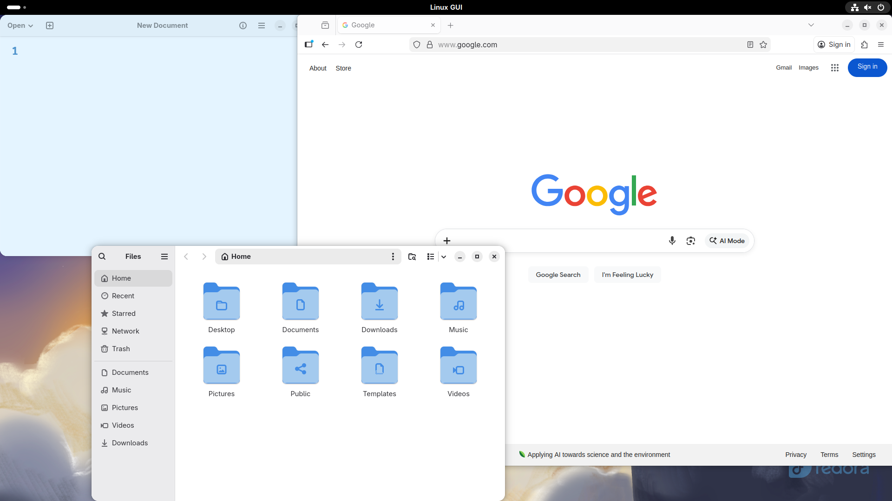
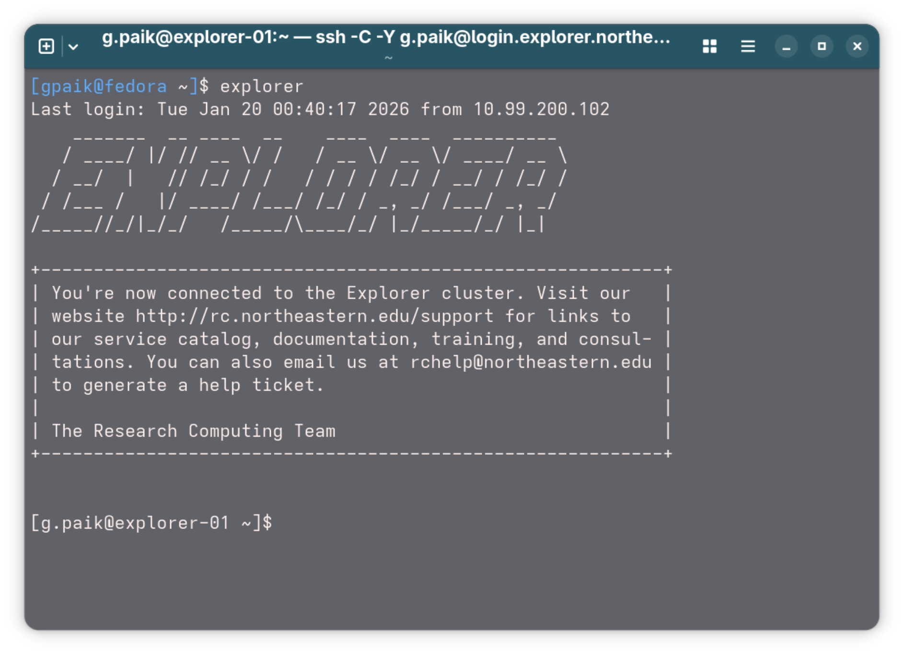
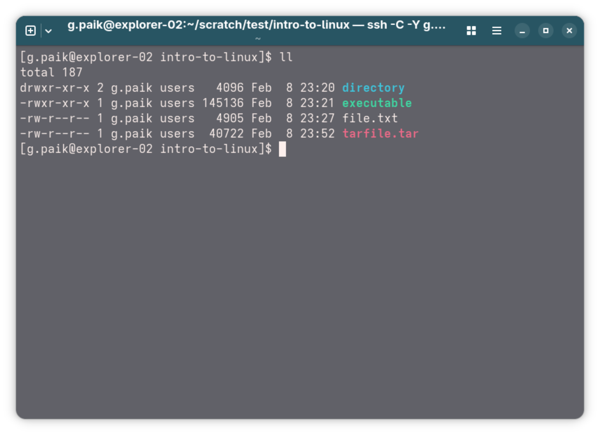
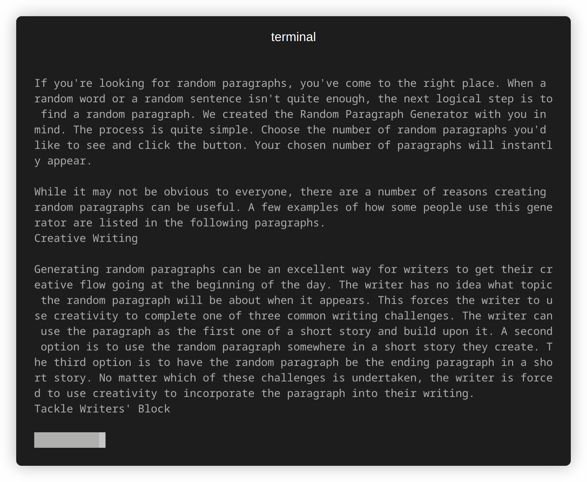
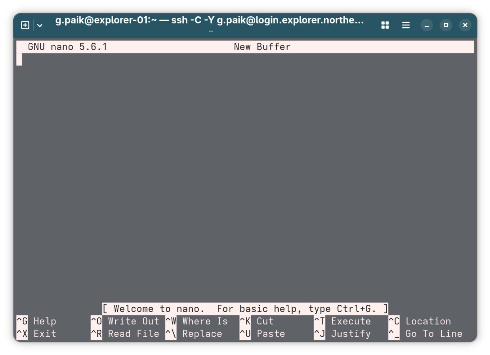
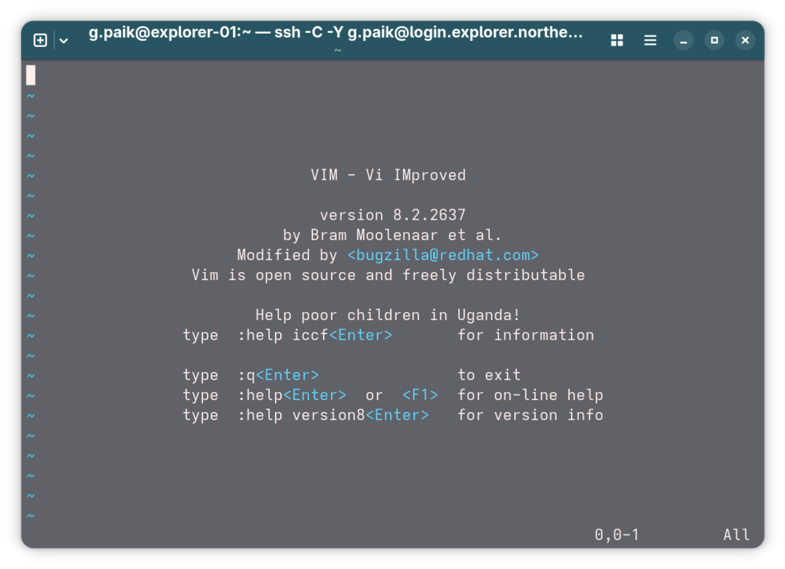
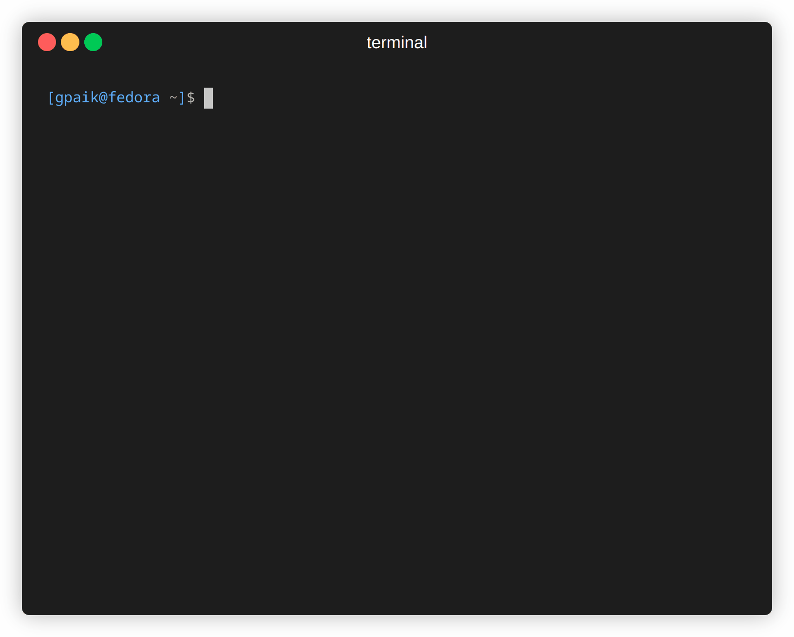
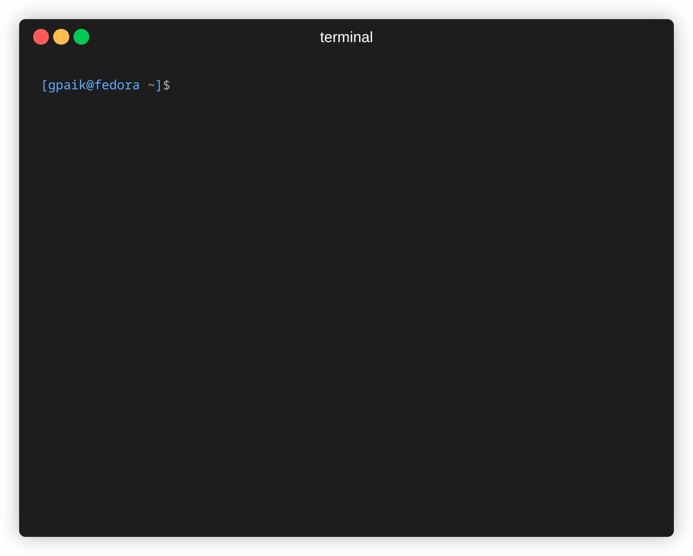
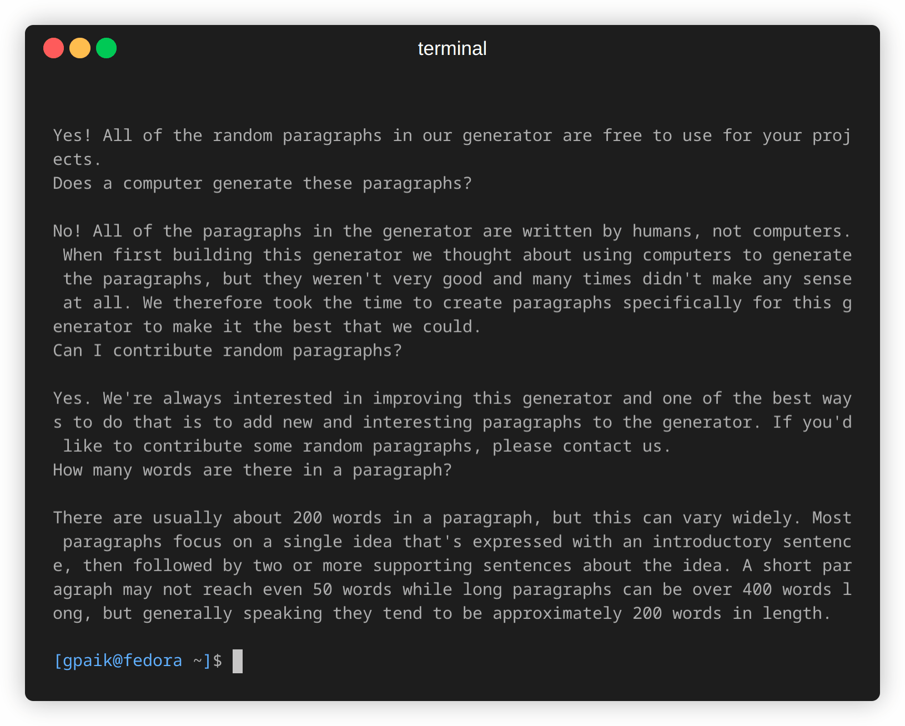

# Research Computing Training

## Presenter

Ghanghoon "Will" Paik

HPC Performance Engineer

[Research Computing](https://rc.northeastern.edu/research-computing-team/)

## Introduction to Linux

Welcome to another session in the [Research Computing Spring 2026 Training Series](https://rc.northeastern.edu/research-computing-spring-training/)!  
We'll learn about basics of Linux terminal.

Today, this presentation will cover:

[1. What is Linux](#1-what-is-linux)  
[2. Navigating File System](#2-navigating-file-system)  
[3. File Management](#3-file-management)  
[4. File Check and Edit](#4-file-check-and-edit)  
[5. Permissions & Ownership](#5-permissions-and-ownership)  
[6. Text Editors (Nano/Vim)](#6-text-editors)  
[7. Additional Tips](#7-additional-tips)  

## 1. What is Linux


Linux is a family of **Operating Systems (OS)** using the Linux Kernel which was originally created by Linus Torvalds in 1991 based on Unix. And, Unix is a much older OS which influenced a lot of other OS created in the future including Linux and macOS.

Linux is widely used in various forms in our life from Android cell phones to personal computers to HPC clusters.

### 1.1 Why Linux?

Linux is based on Free and Open Source community so anyone can contribute to the development. In Linux community, a lot of tools and software are provided for "free" which becomes a huge advantage.

Linux systems are usually considered highly secure and robust. So, they are widely adapted to servers and clusters.

### 1.2 Linux UI

While Linux often provides Graphical User Interface (GUI), it is based on Command Line Interface (CLI). CLI can be accessed by "Terminal".

In terminal, keyboard becomes the main input device.





Once opened, terminal shows user name, host name, current location, and  shell type:

```
[user@host myDir]$
[root@host myDir]#
```

| Presented   | Meaning                        |
| ----------- | ------------------------------ |
| user / root | User name                      |
| host        | Host name                      |
| myDir       | Current location               |
| $ / #       | $: Normal user<br>#: Root user |

In Linux, based on user type (normal vs. root), command execution can be limited. For example, normal user cannot install packages on system.

```bash
# Installing a package without sudo permission
[user@host ~]$ sudo dnf install python
user is not in the sudoers file. This incident will be reported.
```

## 2. Navigating File System

Linux file system is similar to Windows or Mac. Two big items, Files and Directories (folders).



Different highlighting are used in terminal to visually distinguish them. Usually follow the color code below.

| Color         | Type       |
| ------------- | ---------- |
| Blue          | Directory  |
| Green         | Executable |
| Red           | Compressed |
| Black / White | File       |
*Other colors exist for different file types*

### 2.1 Path

Two types to represent the path: Absolute and Relative.

```bash
# Absolute path
/home/user/dir

# Relative path
../dir
```
- `"."` (one dot): current location
- `".."` (two dots): parent location (or one level up)

### 2.2 Move Around

Current location: `$ pwd` (print working directory)

```bash
[user@host ~]$ pwd
/home/user
```
*"`~`" (tilde) represent "Home" directory*

Check files and directories: `$ ls` (list)
```bash
[user@host ~]$ ls
dir1 dir2 dir3 file1 file2 file3
```
- You can use "flags" (or options) like `-l` and `-a`. Or, they can be combined `-la`

	```bash
	[user@host ~]$ ls -l
	total 12
	drwxr-xr-x. 1 user group 90 Jan  8 13:47 dir1
	drwxr-xr-x. 1 user group 82 Jan  9 02:07 dir2
	drwxr-xr-x. 1 user group 94 Jan  8 13:46 dir3
	-rw-r--r--. 1 user group 10 Jan  8 13:44 file1
	-rw-r--r--. 1 user group  3 Jan  8 13:44 file2
	-rw-r--r--. 1 user group  6 Jan  8 13:43 file3

	[user@host ~]$ ls -a
	. .. dir1 dir2 dir3 file1 file2 file3 .hidden1 .hidden2 .hiddenDir
	```
	*Hidden files have "." in front of name (i.e. .hidden1).* 

Change location: `$ cd` (change directory)

```bash
[user@host ~]$ cd dir1
[user@host dir1]$ pwd
/home/user/dir1

# Go one level up
[user@host dir1]$ cd ..
[user@host ~]$ pwd
/home/user

# Go to home
[user@host someDir]$ cd
[user@host someDir]$ cd ~
[user@host ~]$ pwd
/home/user
```

### 3. File Management

Just like GUI environment, files and directories can be managed within terminal.

### 3.1 File/Directory Creation

Create an empty file: `$ touch`

```bash
[user@host emptyDir]$ touch new_file
[user@host emptyDir]$ ls
new_file
```

Create a file with content: **Redirection** (> vs >>)
- `>`: **Overwrites** the file (Clean slate).
- `>>`: **Appends** to the end of the file (Add more).

```bash
# Create (Overwrite)
[user@host emptyDir]$ echo "Hello" > new_file
[user@host emptyDir]$ cat new_file
Hello

# Append
[user@host emptyDir]$ echo "World" >> new_file
[user@host emptyDir]$ cat new_file
Hello
World
```

Create a new directory: `$ mkdir`

```bash
[user@host emptyDir]$ mkdir new_dir
[user@host emptyDir]$ ls
new_dir new_file
```

### 3.2 Move File/Directory

Make a copy of a file or a directory: `$ cp` or `$ cp -R`
(`-R` or recursive is required for directory)

```bash
# Copy a file
[user@host emptyDir]$ cp new_file new_file_copy
[user@host emptyDir]$ ls
new_dir new_file new_file_copy

# Copy a directory
[user@host emptyDir]$ cp -R new_dir new_dir_copy
[user@host emptyDir]$ ls
new_dir new_dir_copy new_file new_file_copy
```

`cp` keeps the original and creates a clone

Move a file or a directory: `$ mv`

```bash
[user@host emptyDir]$ mv new_file_copy ./new_dir_copy
[user@host emptyDir]$ cd new_dir_copy
[user@host new_dir_copy]$ ls
new_file_copy
```

`mv` can be used to rename a file or directory

```bash
[user@host emptyDir]$ mv new_file new_name
[user@host emptyDir]$ ls
new_dir new_dir_copy new_name
```

### 3.3 Remove File/Directory

Remove a file or directory: `$ rm` or `$ rm -r`
(`-r` or recursive is required for directory)

```bash
# Remove a file
[user@host emptyDir]$ rm new_name
[user@host emptyDir]$ ls
new_dir new_dir_copy

# Remove a directory
[user@host emptyDir]$ rm -r new_dir_copy
[user@host emptyDir]$ ls
new_dir
```

**Removing should be done carefully since it cannot be undone.**

### 3.4 Creating Symlinks (Shortcuts)

In Linux, a **Symbolic Link** (or symlink) serves a similar purpose to a **shortcut** in Windows or an **alias** in macOS. It points to another file or directory without taking up extra space.

Create a symlink: `$ ln -s <TARGET> <LINK_NAME>` (Tip: Think of it as "Point to Target, call it Link Name")

```Bash
# Example: Creating a shortcut to a deep directory
[user@host ~]$ ln -s /projects/data/intro_to_linux ./my_data

[user@host ~]$ ls -l
total 0
lrwxrwxrwx 1 user group 18 Feb 12 15:21 my_data -> /projects/data/intro_to_linux
```

- `l`: The line starts with `l`, indicating it is a link.
- `->`: Shows where the link is pointing.
- **Usage**: You can now `$ cd my_data` to access the files in the deep directory immediately.

> Warning: If you move or delete the **original** file, the link will be "broken" (it will point to nowhere).

## 4. File Check and Edit

In terminal, text viewer and editor are often included.
### Short document: `$ cat`

```bash
[user@host ~]$ cat short_doc.txt
hello world!
```

`cat` dumps all the content in terminal. This is not recommended for a long document.

### Long document: `$ less`

```bash
[user@host ~]$ less long_doc.txt
```

`less` is a scrollable text viewer. Use keys (or sometimes mouse wheel) to control the view.



| Key               | Function                  |
| ----------------- | ------------------------- |
| ↑ / ↓ (Arrow key) | Scroll one line up / down |
| Home              | Go to top                 |
| End               | Go to bottom              |
| Page Up / Down    | Scroll a page up / down   |
| q                 | Quit                      |
*Warning: ESC (escape) will not close the viewer.*

## 5. Ownership and File permission

### 5.1 Linux Ownership Types:
|  Type  | Symbol |             Description              |
| :----: | :----: | :----------------------------------: |
|  User  |   u    |  User who owns the file / directory  |
| Group  |   g    | Group which owns the file / directory  |
| Others |   o    |        Everyone on the system        |
|  All   |   a    | All three (owner, group, and others) |

### 5.2 Linux Permission Types:
|     Type      | Symbol | Octal Value |                     Description                      |
| :-----------: | :----: | :---------: | :--------------------------------------------------: |
|     Read      |   r    |      4      |  View file contents or list of files in a directory  |
|     Write     |   w    |      2      |  Modify a file or add / delete files in a directory  |
|    Execute    |   x    |      1      | Run a file as a program or navigate into a directory |
| No permission |   -    |      0      |                    No permission                     |

Example: 
```
# Example Output
-rwxrw-r-- 1 user group 46 Feb 14 16:37 File.txt
^ ^        ^ ^    ^     ^  ^            ^
| |        | |    |     |  |            |
1 2        3 4    5     6  7            8
```
**Breakdown:**
1. **File Type**: `-` (File), `d` (Directory), `l` (Link)
2. **Permissions**: `rwxrw-r--`
3. **Hard Links**: Number of links to this file
4. **Owner**: The user who owns the file (`user`)
5. **Group**: The group who owns the file (`group`)
6. **Size**: File size in bytes (`46`)
7. **Modification Time**: Last edited time
8. **File Name**: Name of the file/directory
#### Decoding Permissions
The first column `-rwxrw-r--` can be confusing. Let's break it down into 4 parts:

```
Type   Owner   Group   Others
[-]    [rwx]   [rw-]   [r--]
 |       |       |       |
File   Read    Read    Read
       Write   Write
       Exec
```
- **Type**: `d` = Directory, `l` = Link, `-` = File
- **Owner (rwx)**: Can Read, Write, and Execute
- **Group (rw-)**: Can Read and Write, but NOT Execute
- **Others (r--)**: Can only Read

### 5.3 Permission Operators
| Operator |    Description    |
| :------: | :---------------: |
|    +     |  Add permission   |
|    -     | Remove permission |

### 5.4 Modify Permission
- Modify permission with "Symbol":
	```bash
	# Add permission
	$ chmod <OWNERSHIP>+<TYPE> <FILE_NAME>
	# Example:
	$ chmod g+x File.txt
	
	# Remove permission
	$ chmod <OWNERSHIP>-<TYPE> <FILE_NAME>
	# Example:
	$ chmod u-x File.txt
	
	# Combination example:
	$ chmod ug+w,o-r File.txt
	```

- Modify permission with "Octal Value":
	```bash
	$ chmod <3 Values> <FILE_NAME>
	# Example:
	$ chmod 751 File.txt
	# USER   = 7: r(4) + w(2) + x(1)
	# GROUP  = 5: r(4) + x(1)
	# OTHERS = 1: x(1)
	```

### 5.5 Modify Ownership
```bash
# File ownership
$ chown <USER>:<GROUP> FILE_NAME

# Directory ownership
$ chown -R <USER>:<GROUP> DIRECTORY_NAME
```

## 6. File Editor

In Linux, a few different Terminal User Interface (TUI) editors are available.
### 6.1 Nano
Most basic and easy to learn text editor.
```bash
$ nano <FILE_NAME>
# Example:
$ nano myFile.txt
```



Shortcuts are listed in the bottom of the screen. Caret symbol (`^`) means `Ctrl` key.
### 6.2 Vi (or ViM)
A bit more advanced text editor.
```bash
$ vim <FILE_NAME>
# Example:
$ vim myFile.txt
```



- Normal mode: Cannot edit a file
- Insert mode: Can edit a file

Switch between normal and insert mode:
1. Press `i` to enter **Insert Mode**
2. Press `ESC` to exit **Insert Mode** (back to **Normal Mode**)
3. Type `:wq` to save and exit in **Normal Mode**

> In case you are stuck, press `ESC` and type `:q!` to force quit without saving.

## 7. Quick Tips

### 7.1 Auto Complete
Use `TAB` key to autocomplete a long file name or command.
```bash
# Without autocomplete
$ cd ~/myResearchProject

# With autocomplete
$ cd ~/myRe<TAB>
$ cd ~/myResearchProject
```



### 7.2 Abort
Use `Ctrl + C` to stop running process or cancel typing.
```bash
# Stop process
$ python longProgram.py
(... no progress for 30 min ...)
<Ctrl + C>

# Cancel a mistyped command
$ cd ~/myRESearchProij
<Ctrl + C>
```



### 7.3 Clear Terminal Screen
Use `clear` command. This command will clean up the terminal screen.



## *Happy Computing!*

## How to get help

Email the Research Computing team at [rchelp@northeastern.edu](mailto:rchelp@northeastern.edu).

Come to [office hours](https://rc.northeastern.edu/getting-help/) hosted on Zoom.

Or [book a consultation](https://rc.northeastern.edu/getting-help/) with an RC team member.

Review our [Documentation](https://rc-docs.northeastern.edu/en/latest/index.html).

Thank you!

---

*For questions or support, contact the Research Computing team at [rchelp@northeastern.edu](mailto:rchelp@northeastern.edu)*
