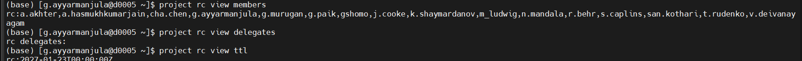
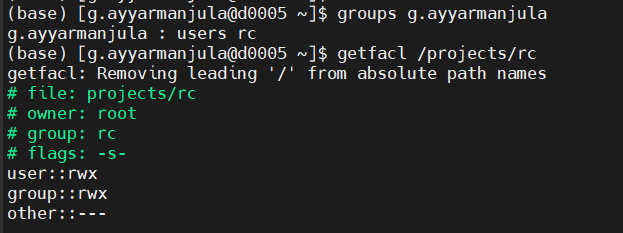

<br>
<br>

# Research Computing Training

## Presenter

Gayathri Ayyar Manjula

Lead Graduate Research Assistant

[Research Computing](https://rc.northeastern.edu/research-computing-team/)

## Managing /projects on Explorer

Welcome to the Research Computing Summer 2026 Training Series! In this training we will be learning how to manage your `/projects` directory on Explorer using the `project` command. This software gives PIs and their delegates direct control over research group membership and storage access — without needing to submit a help ticket for every change.

Today this presentation will cover:

1. [What is /projects?](#what-is-projects)
2. [Terminology and User Roles](#terminology-and-user-roles)
3. [Setup](#setup)
4. [Viewing Your Group](#viewing-your-group)
5. [Adding Users](#adding-users)
6. [Removing Users](#removing-users)
7. [Updating Group Information](#updating-group-information)
8. [Additional Commands](#additional-commands)
9. [Best Practices](#best-practices)
10. [How to get help](#how-to-get-help)

## What is /projects?

The `/projects` directory is the primary long-term storage space for research groups on Explorer. Every user has access to three storage areas:

| Storage Space | Limit | Notes |
| --- | --- | --- |
| `/home/username` | 75 GB | Personal files and scripts |
| `/scratch/username` | 50 TB | Purged on the first Tuesday each month — not for long-term storage |
| `/projects/projectname` | Up to 35 TB (free) | Best for research data, large files, and collaboration |

For large datasets and files shared across a lab, `/projects` is the right place. You can request a projects space via the [storage request form](https://service.northeastern.edu/tech?id=sc_cat_item&sys_id=98ee4a2393c1da10b5e974f86cba10d9).

The `project` command lets PIs manage who has access to their `/projects` space directly from the terminal. No ticket required!

> We highly recommend that PIs designate at least one delegate so that day-to-day membership management doesn't require PI involvement every time.

## Terminology and User Roles

Before running commands, it helps to understand the five user roles. They are listed below from lowest to highest access level.

### 1. Data Custodian

- An email address (does not need to be a cluster user) that receives quota warnings and TTL notifications for the research group
- Optional — a group does not need a data custodian

### 2. Guest

- Can **read and execute** files in the project directory
- Cannot write to the project directory
- Best for collaborators who only need to read data

### 3. Member

- Can **read, write, and execute** in the project directory
- Cannot manage group membership through the `project` command

### 4. Delegate

- Has all Member permissions
- Can **add and remove Members and Guests** on behalf of the PI
- Cannot manage other Delegates

### 5. PI (Owner)

- Has all Delegate permissions
- Can **add and remove Delegates**
- Can view and update the group email and TTL
- Full control over the research group

### TTL (Time To Live)

At the inception of every project, Research Computing establishes a `ttl` (Time To Live), which indicates how long the project is guaranteed to be supported. When the TTL expires, RC will email the PI and data custodian to ask about the status of the project.

> **Important:** The TTL is purely administrative. It does not restrict access or delete data. Its purpose is to let RC confirm whether a group is still active and whether any changes (e.g., a new PI) are needed.

## Setup

The `project` command must be run from a node in the `short` partition — you cannot run it from a login node.

To get onto a compute node in the short partition, run:

```bash
srun -p short --constraint=ib --pty bash
```

```result
[s.caplins@c0123 ~]$
```

You will see a new shell prompt indicating you are on a compute node. You are now ready to run `project` commands.

> **Tip:** Tab completion works with the `project` command! After typing `project <project_name>` press Tab to see available subcommands.

All commands follow this general form:

```bash
project <project_name> <action> <subcommand> <users>
```

## Viewing Your Group

These commands let you inspect your research group's membership and settings.

### View all members

Any member of the group can run this:

```bash
project <project_name> view members
```

```result
Members of <project_name>:
user1
user2
user3
```

### View delegates

Any delegate or the PI can run this:

```bash
project <project_name> view delegates
```

### View guests

Any delegate or the PI can run this:

```bash
project <project_name> view guests
```

### View the group email

Only the PI can run this:

```bash
project <project_name> view groupemail
```

### View the TTL

Only the PI can run this:

```bash
project <project_name> view ttl
```




## Adding Users

> **Note:** When adding multiple users at once, provide a comma-separated list with **no spaces**. For example: `user1,user2,user3`

### Add members

Any delegate or the PI can add members:

```bash
project <project_name> add members <user1,user2,etc.>
```

### Add delegates

Only the PI can elevate users to delegate:

```bash
project <project_name> add delegates <user1,user2,etc.>
```

### Add guests

Only the PI can add guests:

```bash
project <project_name> add guests <user1,user2,etc.>
```

### Worked Example: Adding a new lab member

A new graduate student `jsmith` has just joined the lab. A delegate or PI adds them:

```bash
srun -p short --constraint=ib --pty bash
```

```bash
project mylab add members jsmith
```

```bash
project mylab view members
```

```result
Members of mylab:
pi_username
labmanager
jsmith
```

### Worked Example: Adding multiple users at once

Three rotation students (`rot1`, `rot2`, `rot3`) are starting this semester:

```bash
project mylab add members rot1,rot2,rot3
```

## Removing Users

> **Note:** Use the same comma-separated format for removing multiple users.

### Remove members

Any delegate or the PI can remove members:

```bash
project <project_name> remove members <user1,user2,etc.>
```

### Remove delegates

Only the PI can remove delegate status. Note that removing a delegate does not remove them from the group — they remain a member.

```bash
project <project_name> remove delegates <user1,user2,etc.>
```

### Worked Example: Removing a member who has left the lab

A student `bpatel` has graduated and no longer needs access:

```bash
project mylab remove members bpatel
```

## Updating Group Information

### Update the group email (data custodian)

Only the PI can update this. The email does not need to belong to a cluster user.

```bash
project <project_name> update groupemail <data_custodian_email>
```

## Additional Commands

These standard Linux commands are also useful for inspecting project access:

```bash
# See all groups a user belongs to
groups <username>
```

```result
username : username groupA mylab
```

```bash
# Inspect the Access Control List (ACL) on a project directory
getfacl /projects/<project_name>
```

```result
# file: projects/<project_name>
# owner: root
# group: <project_name>
user::rwx
group::rwx
other::---
```



## Best Practices

**Review membership regularly.**
Students graduate and collaborations end. Periodically run `project <name> view members` to make sure only current lab members have write access.

**Use Guests for external collaborators.**
If someone only needs to read your data, add them as a Guest rather than a Member. This follows the principle of least privilege and protects your data from accidental modification.

**Designate at least one Delegate.**
Consider making a senior lab member (lab manager, postdoc) a Delegate so that day-to-day membership management does not require PI involvement every time.

**Keep your group email current.**
RC uses the group email to send quota warnings and TTL notifications. Make sure it points to an address that is actively monitored.

**Store long-term data in /projects.**
`/scratch` is purged on the first Tuesday of each month. `/home` is limited to 75 GB. `/projects` is the right place for research datasets, analysis pipelines, and shared scripts.

## Quick Reference

| Task | Command | Authorization |
| --- | --- | --- |
| List members | `project <name> view members` | Any member |
| List delegates | `project <name> view delegates` | Delegate / PI |
| List guests | `project <name> view guests` | Delegate / PI |
| View group email | `project <name> view groupemail` | PI only |
| View TTL | `project <name> view ttl` | PI only |
| Add members | `project <name> add members <users>` | Delegate / PI |
| Add delegates | `project <name> add delegates <users>` | PI only |
| Add guests | `project <name> add guests <users>` | PI only |
| Remove members | `project <name> remove members <users>` | Delegate / PI |
| Remove delegates | `project <name> remove delegates <users>` | PI only |
| Update group email | `project <name> update groupemail <email>` | PI only |
| Check user's groups | `groups <username>` | Any user |
| Inspect directory ACL | `getfacl /projects/<name>` | Any user |

> **Before any project command:** `srun -p short --constraint=ib --pty bash`

---

## How to get help

Email the Research Computing team at [rchelp@northeastern.edu](mailto:rchelp@northeastern.edu).

Come to [office hours](https://rc.northeastern.edu/getting-help/) hosted on Zoom.

Or [book a consultation](https://rc.northeastern.edu/getting-help/) with an RC team member.

Review our [Documentation](https://rc-docs.northeastern.edu/en/latest/managingprojects/index.html).

Thank you!

---

*For questions or support, contact the Research Computing team at [rchelp@northeastern.edu](mailto:rchelp@northeastern.edu)*
